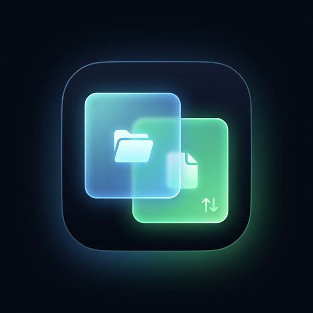

# rcloneCommander

DISCLAIMER: This is a work in progress and is not intended for production use. It is also entirely written by an AI and may contain bugs or security vulnerabilities.

A sleek, dual-pane web interface wrapper built natively to manage your local file system and `rclone` configured remotes simultaneously. Built with a unified Glassmorphic aesthetic, Vite, React, and Node.js.



## Core Features
*   **Dual-Pane Navigation:** Browse both local and `rclone` remotes seamlessly side-by-side natively.
*   **Background Processes:** Heavy copy operations are safely forwarded to standard background shells autonomously tracked by the Node server.
*   **Live Status Monitoring:** Bottom-panel GUI provides precise real-time transfer percentages, autonomous automated interface polling metrics, and active tracking indicators.
*   **Glassmorphic Design:** Aesthetically premium dark-mode interface with precise translucent overlays built exclusively from vanilla CSS.

---

## 🐋 Production Deployment (Docker Compose)

The recommended way to deploy `rcloneCommander` on a home server or public facing domain proxy block is through the unified production container. 

Because the entire interface leverages Native NGINX routing architectures, it bundles natively down into a single exposed port binding!

#### 1. Setup Your Remote Configurations
Before the container can copy external payloads natively across network drives, your base host mapping naturally needs to configure target structures natively using `rclone config`. Proceed through the authentications mapped into exactly `~/.config/rclone/rclone.conf`.

#### 2. Launch the Application Container
Execute the root Docker definition mapping the isolated volume blocks securely.

```bash
docker-compose up -d
```
Navigate directly to roughly **http://localhost:3001/** where your host interface maps symmetrically across your Reverse Proxy hooks explicitly!

---

## 💻 Local Development 

If you plan on modifying CSS, adjusting behavior integrations, or contributing native pipeline revisions explicitly out of development, you should run the natively decoupled framework instances manually so that Vite can apply strict Hot Module Reloading modifications without needing to bounce standard terminal nodes.

### Global Prerequisites
- You must strictly install native `rclone` distributions attached properly globally mapping back into your host's `$PATH`.
- `Node.js` v22 (or a similar modern Node release).

### 1. Launch The Backend Core Controller
Launch the Node.js TS infrastructure binding explicitly out of port `3001`! This process strictly hosts exactly background rclone process bindings mapped over REST protocols.

```bash
cd server
npm install
npm run dev
```

### 2. The Frontend React Framework
Inside a purely secondary terminal session, target exactly the isolated Vite DOM instance to map out graphical logic.

```bash
cd frontend
npm install
npm run dev
```

Your browser will automatically boot directly around `http://localhost:5173/`. If you edit files directly through your external text editor locally, the browser UI will refresh seamlessly automatically!